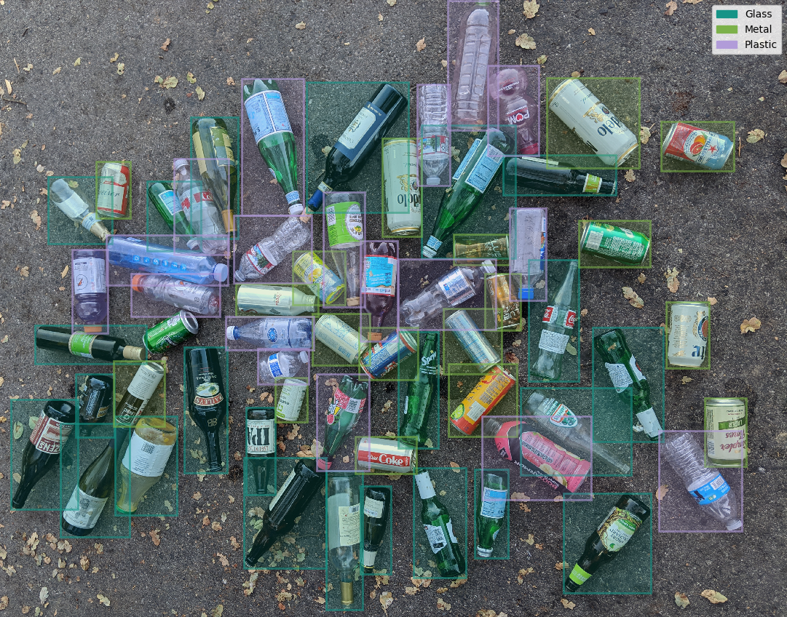
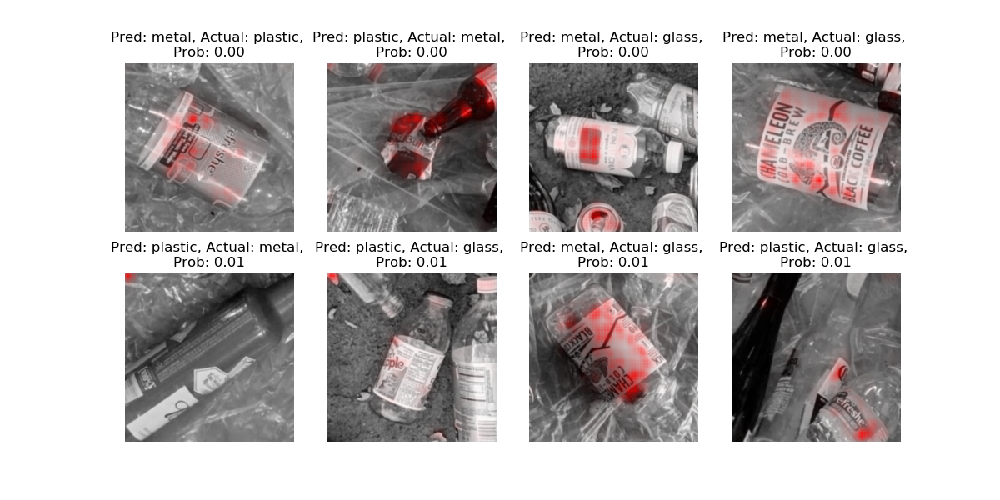
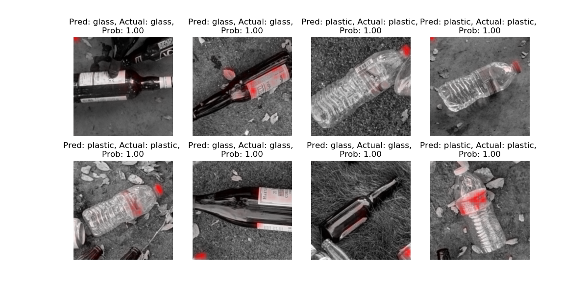

Recycling Detector
==================


The purpose of this project is to create a recycling object detector, however demonstrated here is a recycling classifier trained on data cropped from the bounding boxes of the object detection data.

## Single Object Classifier
The first task was to create an image classifier. This ensured that it would
actually be feasible to distinguish between glass/metal/plastic given the data.
A new dataset was derived for this task by cropping a square image centered at 
each bounding box. Nearby objects provide additional regularization, as the classifier
has to identify the type of object at the center of the image and 
ignore any nearby objects. This is a similar task to what the object detector would
be required to do.

### Data
The data consists of three classes, *glass, metal* and *plastic*. To mimic the object detection class, the correct class for a given image is the object most centrally located, as in the images below.


The data consists of recycling I happened to find in my recycling bin on 
two seperate days. The training dataset consists of 47 unique objects while the 
validation dataset consists of 41 unique objects. The objects in the validation set
are different than the objects in the training set however some of the objects are
the same type, such as Red Bull can, or Coke can.

TODO: Create a test dataset

#### Number of Unique Objects
|Dataset|Glass|Metal|Plastic|Total|
|:---:  |:---:|:---:|:---:|:---:|
|Train	|22   |19   |16   |47|
|Valid  |18   |15   |8    |41|

Due to the few number of unique objects, *object augmentation* was applied in a
variety of ways:
* Changing object orientation
* Changing background: 
	* (grass, wood deck, cement, plastic sheet)
* Swapping/removing bottle caps and labels:
	* This is to promote generalized recognition of the material properties
rather than focusing on features like label color, text, or bottle caps.
It can be seen in the examples below that this objective was not fully realized
* Crushing and denting cans and bottles

#### Number of Training Images
|Dataset|Glass|Metal|Plastic|Total|
|:---:  |:---:|:---:|:---:  |:---:|
|Train	|288  |242  |222    |752  |
|Valid  |215  |171  |88     |474  |

### Model
The classifier is a pretrained resnet50 fine-tuned for the given task.
```python
    model = models.resnet50(pretrained=True)
    num_ftrs = model.fc.in_features
    model.fc = nn.Linear(num_ftrs, 3)
```
### Evaluation
Both the training and validation classes are imbalanced (less so for the training data). For this project I decided I wanted the classifier to have similar accuracy for each class. To achieve this, the loss for each class is weighted by `1 - class_propabilites`.
To  this issue, the loss is weighted by `1 - class_probabilites`.

*The intuition here is that the classifier is penalized more for incorrectly
classifying objects that occure less often in the training, or conversely rewarded less
for identifying objects that occure more often in training.*

I also used the average over the per class accuracies as the validation metric to maximize.

After a few experiments the classifier achieved 85% validation accuracy.
The experiment parameters can be seen in the [insert link here] file.

Lets check out some of the fail cases.

**Worst Validation Images**

*The images are displayed in grayscale with a feature visualization overlayed in red.
The feature visualization code is here, and it is from an Nvidia paper called
Visual Back Propagation.
the 'Prob' value is the probability assigned to the correct class
(which is how these images are ranked).*

The fail cases seem reasonable. The Chameleon cold brew coffee has a metalic film on the label,
which is why I suspect it is being classified as metal. The budwiser in the bottom left is
unlike any of the metal cans in the training set. What is concerning is that the network appears to
be paying attention to the text on the snapple bottle (second from left, bottom row). This is 
not desirable because the labels/text do not cause the object to be any material (but may be highly
correlated). I actualy predicted this when I was collecting the data, and deliberately peeled off
labels an wrapped them around objects of different classes, but apperently this is still a problem.

**Best Validation Images**

*Same as above, but examples with highest probability assigned to correct class are selected*

These Images are perhaps more informative than the fail cases. It reinforces the idea that
some of the strongest features are labels (and also caps for the plastic bottles). I also deliberatly
swapped the caps between class. I'm not sure why some of the corners are lit up by the feature visualization.

TODO:
### Iterate
### Object Detection

